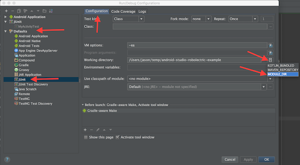
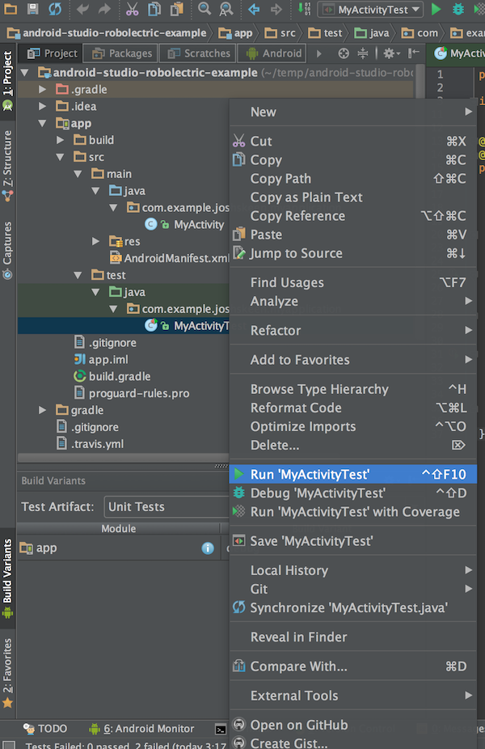

## Android Studio Robolectric Test Example
--- 
This example project shows how to use robolectric, junit and assertJ with your gradle-based Android Studio projects.
Examine the top-level build.gradle and app/build.gradle files for a new project configuration gradle boilerplate.

Make sure you're running the most recent version of Android Studio from the Canary Channel for this to work correctly (1.2 Beta as of today).

### To set up from a new Android Studio Project: 

Add test dependencies on assertj-android and Robolectric to your module's build.gradle file. Your app module's app/build.gradle file would look something like this:

```javascript
apply plugin: 'com.android.application'
android {
    compileSdkVersion 23
    buildToolsVersion "23.0.1"

    defaultConfig {
        applicationId "com.example.joshskeen.myapplication"
        minSdkVersion 16
        targetSdkVersion 23
        versionCode 1
        versionName "1.0"
    }

    buildTypes {
        release {
            minifyEnabled false
            proguardFiles getDefaultProguardFile('proguard-android.txt'), 'proguard-rules.pro'
        }
    }
}

dependencies {
    compile fileTree(dir: 'libs', include: ['*.jar'])
    testCompile 'junit:junit:4.12'
    testCompile 'com.squareup.assertj:assertj-android:1.1.0'
    testCompile 'org.robolectric:robolectric:3.0'
}
```

2. If they don't already exist, create directories matching src/test/java/ and add a package matching your project's packagename. E.g. src/test/java/com.example.joshskeen.myapplication
 


4. Sync your gradle file by clicking 'Sync Project with Gradle Files'
 

 
5. Select "Unit Tests" under "Build Variants"
 

6. Update default JUnit working directory. Select *Run/Debug Configurations*, then *Defaults*, then *JUnit*, then *Configurations* tab, then *Working directory*, and finally *MODULE_DIR*.: 

5. ctrl + click on the test and select Run MyActivityTest. 

6. Create your unit test in src/test/java/com.example.joshskeen.myapplication/MyActivityTest.java:
```java
@RunWith(RobolectricGradleTestRunner.class)
@Config(constants = BuildConfig.class, sdk = 21)
public class MyActivityTest {

    private MyActivity mActivity;

    @Before
    public void setup() {
        mActivity = Robolectric.buildActivity(MyActivity.class).create().get();
    }

    @Test
    public void myActivityAppearsAsExpectedInitially() {
        assertThat(mActivity.mClickMeButton).hasText("Click me!");
        assertThat(mActivity.mHelloWorldTextView).hasText("Hello world!");
    }

    @Test
    public void clickingClickMeButtonChangesHelloWorldText() {
        assertThat(mActivity.mHelloWorldTextView).hasText("Hello world!");
        mActivity.mClickMeButton.performClick();
        assertThat(mActivity.mHelloWorldTextView).hasText("HEY WORLD");
    }

}
```

7. Write Robolectric Tests! For more intel on how to write tests using robolectric + assertJ, check out [http://blog.bignerdranch.com/2583-testing-the-android-way/](http://blog.bignerdranch.com/2583-testing-the-android-way/)


